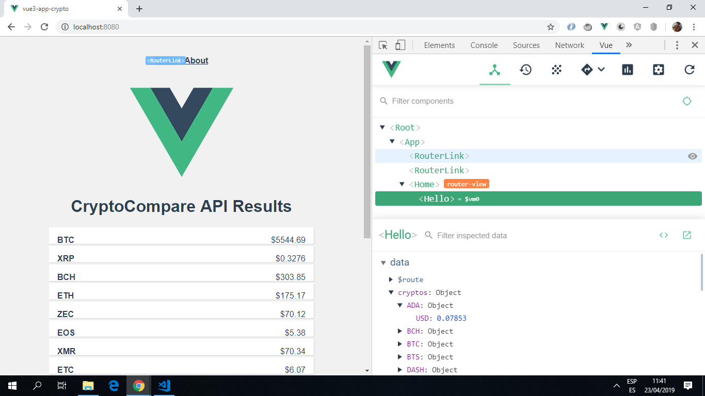

# Vue3 App Crypto

* Vue3 app to get crypto currency price data from a [CryptoCompare API](https://min-api.cryptocompare.com/).

**Note:** to open web links in a new window use: _ctrl+click on link_

## Table of contents

* [General info](#general-info)
* [Screenshots](#screenshots)
* [Technologies](#technologies)
* [Setup](#setup)
* [Features](#features)
* [Status](#status)
* [Inspiration](#inspiration)
* [Contact](#contact)

## General info

* Axios used to get API data.

* Data displayed using one-way data-binding and a v-for loop.

## Screenshots



## Technologies

* [Vue framework v3.6.3](https://vuejs.org/)

* [Vue Router v3.0.3](https://router.vuejs.org/) the official router for Vue.js

* [Vue CLI v3.6.0](https://cli.vuejs.org/)

* [Axios v0.18.0](https://github.com/axios/axios), a promise-based http client, is used to consume API data.

* [Vue DevTools extension for Chrome](https://chrome.google.com/webstore/detail/vuejs-devtools/nhdogjmejiglipccpnnnanhbledajbpd).

## Setup

Run `npm run serve` then navigate to `http://localhost:8080/`. The app will automatically reload if you change any of the source files.

## Code Examples

```javascript

* Extract from Hello.vue: function to get cryptocurrency data from the API 

	created () {
		const fsymsList = 'BTC,XRP,BCH,ETH,ZEC,EOS,XMR,ETC,LTC,DASH,QTUM,NEO,XLM,TRX,ADA,BTS,USDT,XUC,PAX,IOT';

	  axios.get('https://min-api.cryptocompare.com/data/pricemulti?fsyms=' + fsymsList + '&tsyms=USD')
	  .then(response => {
		  this.cryptos = response.data
		  console.log(response)
	  })
	  .catch(e => {
		  this.errors.push(e)
	  });
  }

```

## Features

* uses the new Vue3 CLI.

## Status & To-Do List

* Status: Simple working app.

* To-Do: add functionality.

## Inspiration

* [Coursetro Vue.js CryptoCurrency Tutorial - Display Exchange Data with an API](https://www.youtube.com/watch?v=S0Zznlv1qnI)

## Contact

Created by [ABateman](https://www.andrewbateman.org) - feel free to contact me!!!
