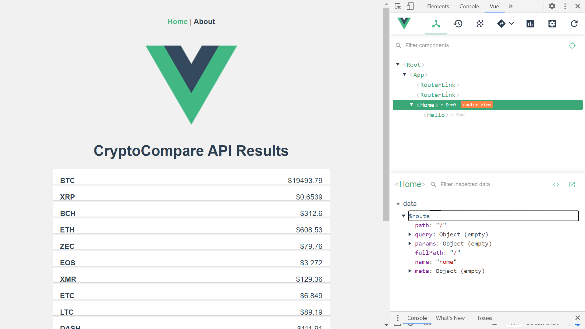
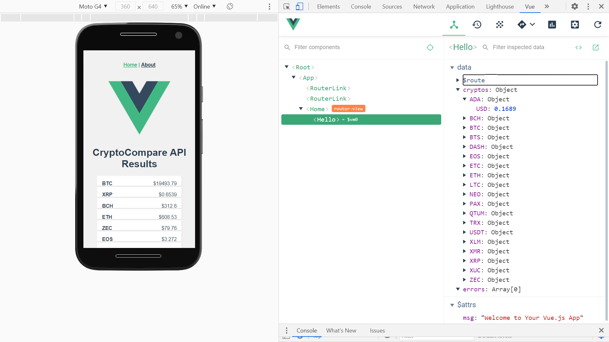

# :zap: Vue3 App Crypto

* Vue3 app to get crypto currency price data from a [CryptoCompare API](https://min-api.cryptocompare.com/).

**Note:** to open web links in a new window use: _ctrl+click on link_

## :page_facing_up: Table of contents

* [:zap: Vue3 App Crypto](#zap-vue3-app-crypto)
	* [:page_facing_up: Table of contents](#page_facing_up-table-of-contents)
	* [:books: General info](#books-general-info)
	* [:camera: Screenshots](#camera-screenshots)
	* [:signal_strength: Technologies](#signal_strength-technologies)
	* [:floppy_disk: Setup](#floppy_disk-setup)
	* [:computer: Code Examples](#computer-code-examples)
	* [:cool: Features](#cool-features)
	* [:clipboard: Status & To-Do List](#clipboard-status--to-do-list)
	* [:clap: Inspiration](#clap-inspiration)
	* [:envelope: Contact](#envelope-contact)

## :books: General info

* Axios used to get API data.
* Data displayed using one-way data-binding and a v-for loop.

## :camera: Screenshots




## :signal_strength: Technologies

* [Vue v2.6](https://vuejs.org/) framework
* [Vue Router v3](https://router.vuejs.org/) the official router for Vue.js
* [Vue CLI v3](https://cli.vuejs.org/)
* [Axios v0.21.0](https://github.com/axios/axios), a promise-based http client, is used to consume API data.
* [Vue DevTools extension for Chrome](https://chrome.google.com/webstore/detail/vuejs-devtools/nhdogjmejiglipccpnnnanhbledajbpd).

## :floppy_disk: Setup

* Run `npm i` to install dependencies
* Run `npm run lint` to lint and autofix files
* Run `npm run test` to runs tests - no tests specified
* Run `npm run serve` then navigate to `http://localhost:8080/`. The app will automatically reload if you change any of the source files.
* Run `npm run build` to compile and minify for production

## :computer: Code Examples

```javascript

* Extract from Hello.vue: function to get cryptocurrency data from the API

	created () {
		const fsymsList = 'BTC,XRP,BCH,ETH,ZEC,EOS,XMR,ETC,LTC,DASH,QTUM,NEO,XLM,TRX,ADA,BTS,USDT,XUC,PAX,IOT';

	  axios.get('https://min-api.cryptocompare.com/data/pricemulti?fsyms=' + fsymsList + '&tsyms=USD')
	  .then(response => {
		  this.cryptos = response.data
		  console.log(response)
	  })
	  .catch(e => {
		  this.errors.push(e)
	  });
  }

```

## :cool: Features

* uses the new Vue3 CLI.

## :clipboard: Status & To-Do List

* Status: Working.
* To-Do: add functionality.

## :clap: Inspiration

* [Coursetro Vue.js CryptoCurrency Tutorial - Display Exchange Data with an API](https://www.youtube.com/watch?v=S0Zznlv1qnI)

## :envelope: Contact

* Repo created by [ABateman](https://www.andrewbateman.org) - you are welcome to [send me a message](https://andrewbateman.org/contact)
